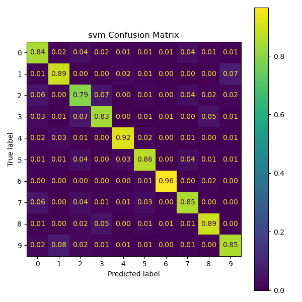
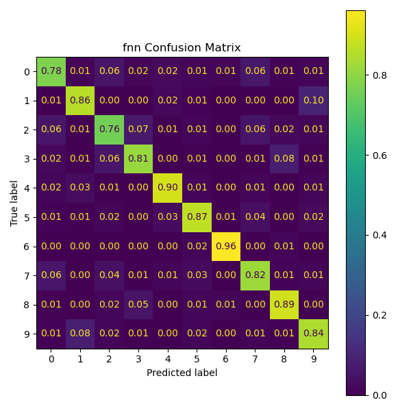
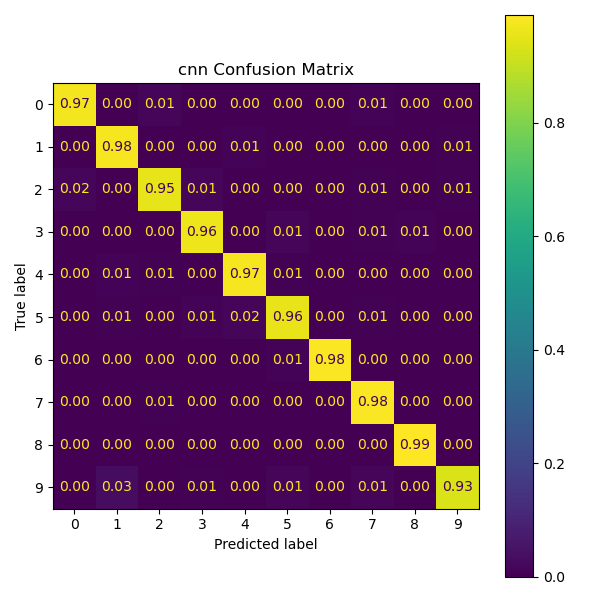

# MFCC-Based Audio Digit Classification with Machine Learning and Deep Learning
This project benchmarks different machine learning and deep learning models on the task of spoken digit classification using MFCC features extracted from raw audio recordings. Models include Support Vector Machines (SVM), Feedforward Neural Networks (FNN), and Convolutional Neural Networks (CNN), implemented with PyTorch and scikit-learn. The project focuses on data preprocessing, model training, tuning, and comparative evaluation. 

## Key Features
- Converts raw `.wav` audio files into Mel-Frequency Cepstral Coefficients (MFCCs) for model input
- Benchmarks three model types:
    - SVM on standardized averaged MFCC vectors with scikit-learn
    - FNN on standardized averaged MFCC vectors with PyTorch
    - CNN on raw MFCC time-series matrices treated as 2D inputs
- Implements training with 
    - Learning rate scheduling
    - Early stopping based on validation loss
    - Regularization with dropout and weight decay
- Evaluates models using:
    - Accuracy scores and classification reports
    - Confusion matrices
    - Training/validation loss and accuracy curves
- Ensures reproducibility with saved scalers, model checkpoints, and fixed data splits

## Data Extraction & Feature Engineering
- Data used is from the AudioMNIST dataset (https://github.com/soerenab/AudioMNIST) which contains 30,000 audio samples of spoken digits (0-9) of 60 different speakers. 
- Audio files are loaded in at a sampling rate of 16,000 Hz.
- For each audio sample, 25 MFCCs are extracted using `librosa`. Based on models needs, two types of MFCCs features are created. 
    - Averaged MFCC Vectors: Mean of MFCCs across time, used for SVM and FNN models
    - Time-Series MFCC Matrices: Full MFCC time sequence with zero padding used for CNN model

- For SVM and FNN models, features were standardized using `StandardScaler`; the CNN model used raw MFCC matrices without standardization

## Model Training & Optimization  

- All models were trained using stratified train/validation/test splits to ensure class balance  
- SVM was trained with `GridSearchCV` using 3-fold stratified cross-validation
- FNN and CNN training included:
  - Early stopping based on validation loss  
  - Learning rate reduction on plateau  
  - Batch training with multi-core DataLoaders  
  - Optimized using Adam with weight decay regularization  
- Model checkpoints saved on best validation performance  
- Experimented with different FNN and CNN architectures (adjusting depth, layer sizes, activation functions, and dropout rates) to find architectures that balanced fitting capacity with generalization performance on validation data

## Final Model Architectures  

- SVM (scikit-learn):
  - Kernel: RBF  
  - Regularization Parameter (C): 4  
  - Class Weight: Balanced  

- Feedforward Neural Network (PyTorch):  
  - Architecture: 25 → 256 → 128 → 64 → 10  
  - Activation: ReLU after each hidden layer  
  - Dropout: 20% applied after each hidden layer  
  - Optimizer: Adam with weight decay and learning rate scheduler  

- Convolutional Neural Network (PyTorch):
  - Architecture:
    - Input: (1, 25, 32)
    - Conv2D (1 → 16) → ReLU → MaxPool → Conv2D (16 → 32) → ReLU → MaxPool
    - Flatten → Fully Connected (1536 → 64) → ReLU → Fully Connected (64 → 10)
  - Activation: ReLU after each convolution and fully connected layer
  - Regularization: MaxPooling layers to reduce spatial dimensions
  - Optimizer: Adam with learning rate scheduler and early stopping

## Model Evaluation Results

<table>
  <tr>
    <th>Model & Accuracy</th>
    <th>Normalized Confusion Matrix</th>
  </tr>
  <tr>
    <td><strong>SVM</strong> 87% Test Accuracy</td>
    <td></td>
  </tr>
  <tr>
    <td><strong>FNN</strong> 85% Test Accuracy</td>
    <td></td>
  </tr>
  <tr>
    <td><strong>CNN</strong> 97% Test Accuracy</td>
    <td></td>
  </tr>
</table>

